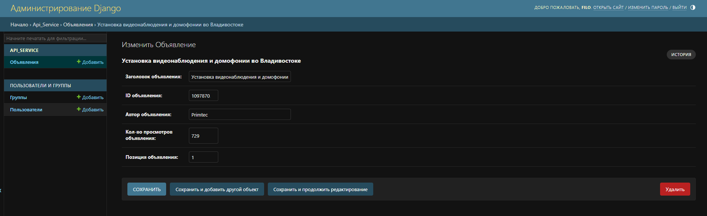
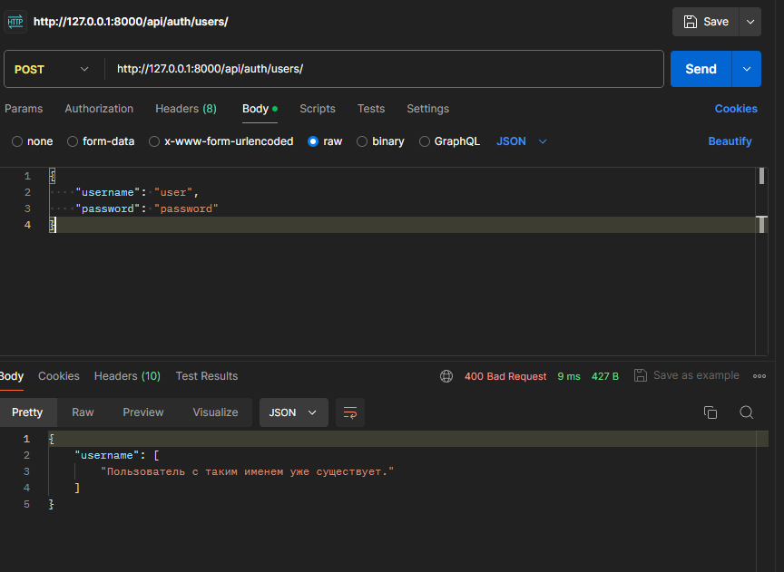
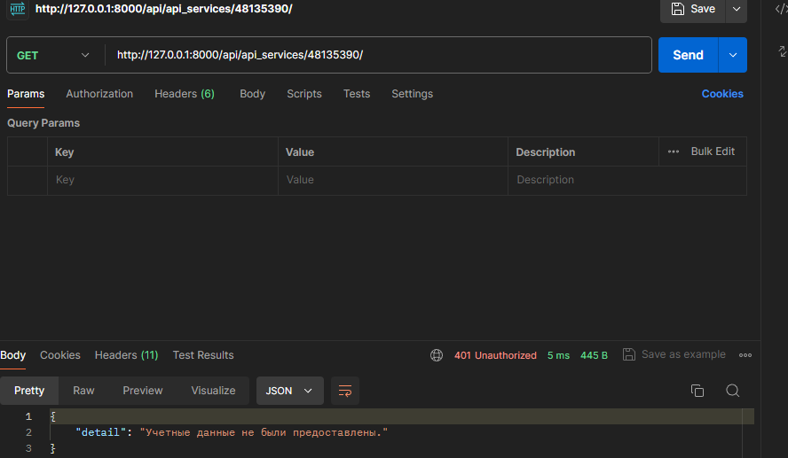
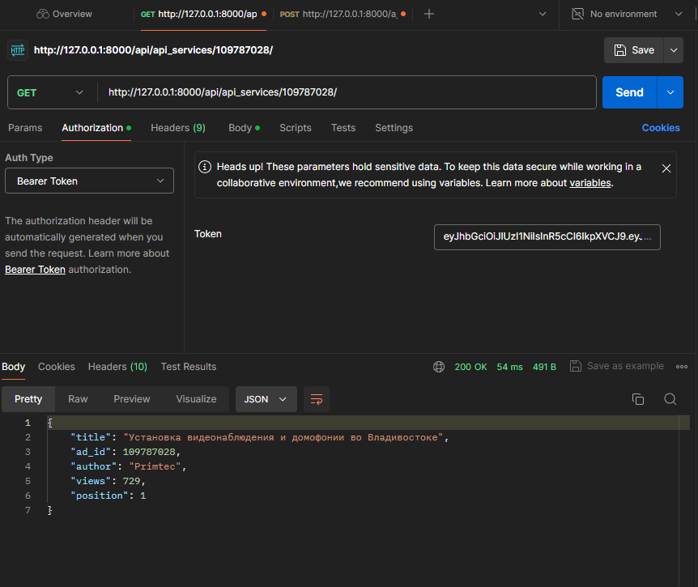
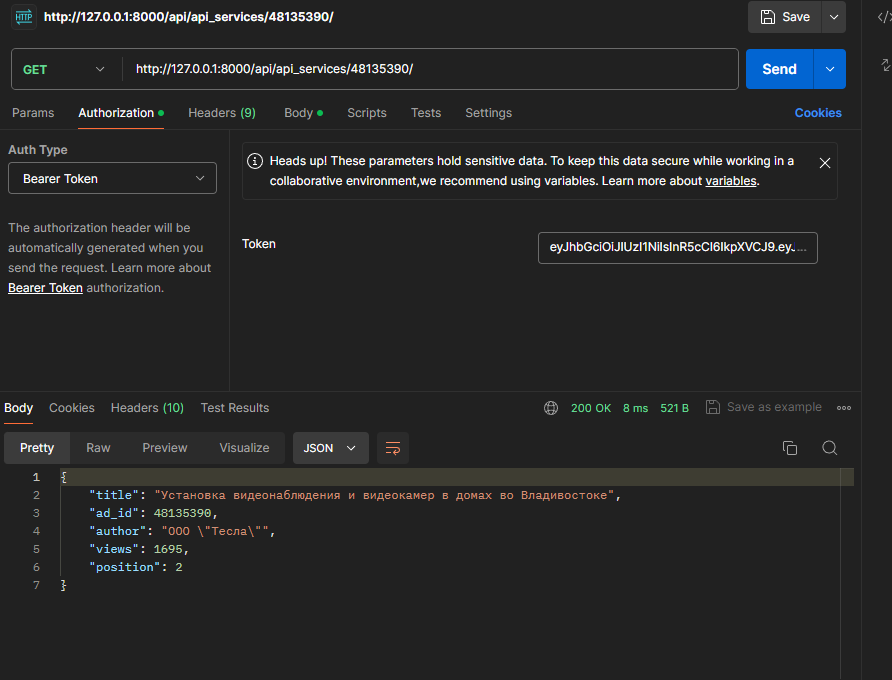

# Тестовое задание на позицию Backend-разработчик на языке Python.

## Что сделано:

* Модель со следующими полями: заголовок, id, автор, кол-во просмотров, позиция объявления.
* Админ-панель, через которую можно вносить данные в БД.
* Методы API для получения информации об объявлении по ID объявления.
* Система регистрации и входа для подключения к API по JWT-токену

### Как запустить проект на локальной машине:
###### Клонировать репозиторий и перейти в него в командной строке:
`git clone https://github.com/Igor-L12/test_api_django.git`
`cd test_api_service`
###### Создать и активировать виртуальное окружение:
`python -m venv venv`
`. venv/Scripts/activate`
###### Установить зависимости из файла requirements.txt:
`pip install -r requirements.txt`
###### Создать и выполнить миграции:
`python manage.py makemigrations`
`python manage.py migrate`
###### Запустить проект:
`python manage.py runserver`

### Примеры запросов:
Пример GET-запроса для получения информации

*GET .../api/api_services/12345678/

Пример GET-ответа:
```
{
    "title": "Название объявления",
    "ad_id": "12345678",
    "author": "Author",
    "views": 100,
    "position": 1
}
```
### Админ-панель:


### Авторизация:


### Запрос без авторизации:


### Пример 1:


### Пример 2:


Автор: [Игорь Любаев](https://github.com/Igor-L12)